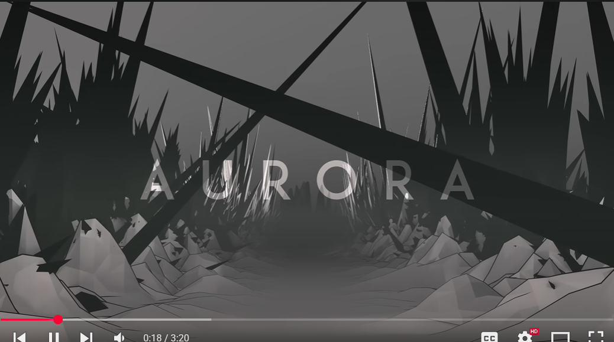

//
- [ ] A MUSIC DISC
- [ ] Completely unsolicited dani reference because i felt nostalgic
- [ ] mc tree maker framework or something because it's kinda pain
- [ ] fix: deprecated petal cutout renderer
- [ ] fix: silver birch detached check is a bit loose but you do only get a few saplings here and there per biome so it's ok for now
- [ ] fix: maybe try fixing the grass color for silver birch again??
- [ ] i think you can manipulate biome rarity with custom regions rather than the overworld
- [x] fix: silver birch has grass inside
- [ ] fix: use a placed feature instead of a structure because why again
- [ ] do more complex biomes with a custom biome source
//

- [x] Mystic biome
-------------------------
- [x] Arcane Hysteria tree. And some sorta mystic biome. The vibe is kind of eerie, unsettling. "Some say the souls still scream even when sawed into planks. This is, of course, untrue! *Probably*."
- [ ] Implement bushes 
- [ ] Wizard tower as a structure
- [ ] ask miwa to make concepts?
- [ ] make hexfruit modify the player's health instead of an effect ; or a custom effect, makes more sense because it has a timer ; actually vanilla does 2 hearts if you don't pass an amplifier already, convenient ; still would be cool as a custom effect to stack with other mods
- [x] brush up door texture
- [x] make amethysts spawn on the ground

//

- [ ] Spiky desert
-------------------------
- [ ] Big ahh spikes of like cool blocks

//

- [ ] some wonky birch biome because hate 
-------------------------

- [ ] double down on fireflies
- [ ] but funky not just that trailer

//

### just a good forest biome or three

-------------------------

- [ ] maple forests
- [ ] larch forest or smth spiny 
- [ ] deserts but fun (like dry)
-------------------------

//

### just a good shrubland or two

-------------------------

- [ ] something very dead
- [ ] something not very dead
- 
-------------------------

### some sort of ruins

-------------------------

- [ ] of some medieval civ
-------------------------

### some sort of ruins

-------------------------

- [ ] of some medieval civ
- 
-------------------------

### golden forest

-------------------------

- [x] like that one bedwars map, silver birch or something
- [x] surface rule for terracotta everywhere
- [x] the dead leaves on the ground and particles maybe (just copy cherry) ; "just copy cherry" my ass how naive 

-------------------------

### that quirky azalea tree biome

-------------------------

- [ ] in the test world

-------------------------

### some sort of nostalgic biomes

-------------------------

- [ ] kinda like terralith has but original ; out of ideas for this one

-------------------------

### ROSE FOREST

-------------------------

- [ ] like that one park Harun and Burzo made

-------------------------

### Some sorta geothermal biome

-------------------------

- [ ] i should stop getting my ideas from Terralith

-------------------------

### Underground crystal biome

-------------------------

- [ ] like glass but amethyst style and coolr

-------------------------

### Some sorta bamboo-ish i guess tranquill biome

-------------------------

- [ ] mint skies, mint trees, little leaves, mountainous terrain

-------------------------

### Just a pretty lilac biome 

-------------------------

- [ ] Different cherry trees but lilac and with papers hanging down the trees ()
- [ ] Pastelwood

-------------------------

### Desolate cold biome 

-------------------------

- [x] Some sorta like really desolate black ice biome, it must be scawy ()
- [x] heartache ice - Distilled dread... it didn't just gather in here by itself. What could have caused such a ... what even happened here? There's a structure that's a heart built of white ice, frozen solid, no longer beating, it always spawns submerged into the ice sheets
- [x] vanilla uses structures for this stuff ; no it doesn't, place feature go br
- [x] dark fog (neo has an event?)
- [x] permanent snowstorm
- [x] wind ambience
- [x] add powdery snow, and rarely at that to cause as much pain as possible
- [x] bury the heart somehow
- [x] structure with a lamp and a direction sign saying something a la "lost" or "undefined"
- [ ] maybe: I could make the wind direction server side so it can be synced between people but kind too minor of a thing
- [ ] maybe: technically it never actually snows with snow layers which is kinda lame but also whatever
- [ ] maybe fix: place snow layers on top of powdered snow

-------------------------

### Biome with mixed trees

-----------------------
- [ ] mixed forest of different trees, red, green, greener, yellow, idk

### Some sort of island biome

-----------------------
- [ ] how was that tropical dimension mod called again
