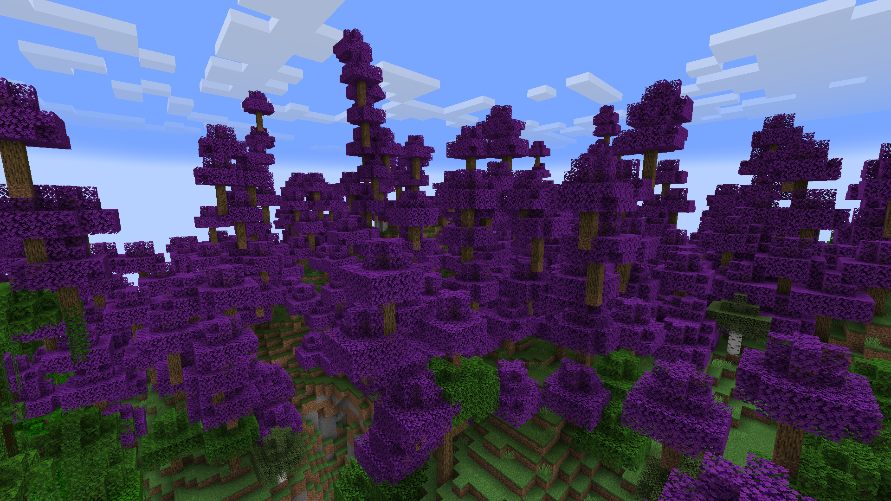

//
- [x] A MUSIC DISC
- [ ] Completely unsolicited dani reference because i felt nostalgic ; milk
- 
- [x] mc tree maker framework or something because it's kinda pain
- [ ] unrelated but make like an actually good color picker website cuz im annoyed
- [ ] framework for turn nbt into placed feature gen ; place like fossils do, plus already exists 
- [ ] a mod that makes players edible
- [ ] a minecraft biome and terrablender biome guide, no one has to suffer through this shit again ; also make it an example mod ; !!!

- [x] FIX IMPORTANT: FILL BIOME RANGES (e.g. oceans) ; the one image that explains terrablender says to fill them fully but that sounds horrific, i'll have to recreate vanilla? no thank u, unless im misunderstanding something i'd just fill in oceans with ocean which would make vanilla oceans a bit more boring but prevent my biomes from spawning in them ; terrablender builder
- [x] fix: deprecated petal cutout renderer
- [ ] maybe fix: silver birch detached check is a bit loose but you do only get a few saplings here and there per biome so it's ok for now. ; it adds to the biome
- [ ] fix: maybe try fixing the grass color for silver birch again??
- [x] fix: silver birch has grass inside
- [x] fix: use a placed feature instead of a structure because why again
- [x] add more creative mod tabs ; just sorted the one tab i have
- [x] fix: fountains generate with grass corners
- [x] fix: dusty biome
- [ ] finish: shrooms
- [ ] maybe marble columns and etc.
- [ ] actually put marble in somewhere
- [x]
- [ ]  report VanillaParameterOverlayBuilder mob spawn issue if it's still a thing in 1.21.9
- [x]  find workaround to keep shroomboi spawning ; maybe keep at monster/ambient for now ; terrablender's builder let's go
- [x]  !!! make surface rules not generate stuff underground ; find some way to copy vanilla !!!
- [x]  distribute the biomes with a fresh (balder) head ; im gonna die this is so funny
- [x]  add overrides to terrablender's builder for exceptions
- [x]  fix: desolate biome effects should not work underground
- [x]  redistribute the biomes according to the annotation
- [ ]  do a 50/50 on some biomes if that would work reasonably ??? ; couldnt with current terrablender rip ; on my Christmas wishlist 
- [ ]  melon helmet
- [ ]  finish: pumpkin
- [ ]  fix: unchecked operation somewhere
- [ ]  fix: maybe use offset to prevent patchiness? ; no
- [x]  fix: logs not stripping
- [ ]  fix: potted blocks for saplings
- [ ]  fix: try to make a 50/50 replace later again ; !
- [ ]  fix: make disc obtainable ; any loot table chest? ; or dungeons
- [x]  fix: i can make freaking WATERFALLS
- [ ]  fix: do some profiling to make sure i didnt add any performance pitfalls
- [x]  fix: anthocyanin should spawn near jungle
- [ ]  fix: add teaser hut structure
- [x]  fix: later rework foliage places to be more sensible
- [x]  fix: dont forget the waterfalls ewew
- [ ]  TODO: IMPORTANT: maybe if i can pull it off this time, add biome replacements, so it's 50% to back to the vanilla biome, why? because they all keep spawning in the same region, this is one way to solve the problem of all biomes being clumped together in the region, give each a 50/50 vanilla alternative and in turn just make it rarer
- [ ]  TRAILER: -5621453417704106832  -291172 158 5765  screenshottable as hell
- [ ]  look into isSolid
- [ ]  make mod to make leaf litter and etc replaceable if it's not a thing on later versions

- [x] distribute biome rarity w regions ; also make them not spawn too high ; silver birch seems to not generate like at all rn

- //

- [x] music
-------------------------
- [x] compose some music for the trailer 
- https://www.youtube.com/watch?v=srhTqupfGyQ 8:45 sounds like it'd fit really well maybe i could use it as inspiration
--------------------

- [x] Mystic biome
-------------------------
- [x] Arcane Hysteria tree. And some sorta mystic biome. The vibe is kind of eerie, unsettling. "Some say the souls still scream even when sawed into planks. This is, of course, untrue! *Probably*."
- [ ] Implement bushes 
- [ ] Wizard tower as a structure
- [ ] make hexfruit modify the player's health instead of an effect ; or a custom effect, makes more sense because it has a timer ; actually vanilla does 2 hearts if you don't pass an amplifier already, convenient ; still would be cool as a custom effect to stack with other mods
- [x] brush up door texture
- [x] make amethysts spawn on the ground

//

- [ ] Spiky desert
-------------------------
- [ ] Big ahh spikes of like cool blocks

//

- [ ] some wonky birch biome because hate 
-------------------------

- [ ] double down on fireflies
- [ ] but funky not just that trailer

//

### just a good forest biome or three

-------------------------

- [ ] maple forests
- [ ] larch forest or smth spiny 
- [ ] deserts but fun (like dry)
-------------------------

//

### just a good shrubland or two

-------------------------

- [ ] something very dead
- [x] something not very dead
- 
-------------------------

### some sort of ruins

-------------------------

- [ ] of some medieval civ
-------------------------

### some sort of ruins

-------------------------

- [ ] of some medieval civ
- 
-------------------------

### golden forest

-------------------------

- [x] like that one bedwars map, silver birch or something
- [x] surface rule for terracotta everywhere
- [x] the dead leaves on the ground and particles maybe (just copy cherry) ; "just copy cherry" my ass how naive 

-------------------------

### that quirky azalea tree biome

-------------------------

- [ ] in the test world

-------------------------

### some sort of nostalgic biomes

-------------------------

- [ ] kinda like terralith has but original ; out of ideas for this one

-------------------------

~~### ROSE FOREST~~

-------------------------

~~- [ ] like that one park Harun and Burzo made~~ ; did orderly ruins instead

-------------------------

### Some sorta geothermal biome

-------------------------

- [ ] i should stop getting my ideas from Terralith

-------------------------

### Underground crystal biome

-------------------------

- [ ] like glass but amethyst style and coolr

-------------------------

### Some sorta bamboo-ish i guess tranquill biome

-------------------------

- [ ] mint skies, mint trees, little leaves, mountainous terrain

-------------------------

### Just a pretty lilac biome 

-------------------------

- [x] Different cherry trees but lilac and with papers hanging down the trees ()
- [x] Pastelwood
- [ ] better gen ; so it doesn't clash with cherry ; maybe just replace cherry occasionally? 
- [ ] maybe a variant with hanging light emitting fruit/papers?
- [ ] papers or hanging wisteria

-------------------------

### Desolate cold biome 
-------------------------

- [x] Some sorta like really desolate black ice biome, it must be scawy ()
- [x] heartache ice - Distilled dread... it didn't just gather in here by itself. What could have caused such a ... what even happened here? There's a structure that's a heart built of white ice, frozen solid, no longer beating, it always spawns submerged into the ice sheets
- [x] vanilla uses structures for this stuff ; no it doesn't, place feature go br
- [x] dark fog (neo has an event?)
- [x] permanent snowstorm
- [x] wind ambience
- [x] add powdery snow, and rarely at that to cause as much pain as possible
- [x] bury the heart somehow
- [x] structure with a lamp and a direction sign saying something a la "lost" or "undefined"
- [ ] maybe: I could make the wind direction server side so it can be synced between people but kind too minor of a thing
- [ ] maybe fix: technically it never actually snows with snow layers which is kinda lame but also whatever
- [ ] maybe fix: place snow layers on top of powdered snow
- [ ] shaders eat fog
- [ ] make for configurable
-------------------------

### Biome with mixed trees
-----------------------
- [x] mixed forest of different trees, red, green, greener, yellow, idk

### Some sort of island biome
-----------------------
- [ ] how was that tropical dimension mod called again

### Grainy desert
-----------------------
- [ ] gravel + sand + something else stashed into a desolate landscape with occasional oasises

### Some frozen as hell forest
-----------------------
- [ ] a frozen forest with white trees and ice everywhere

### golf flats
-----------------------
- [x] A flat biome with orderly trees like in that one world
- [x] less flat more terrain
- [x] fountain
- [x] structures
- [x] variants

### tree on tree forest
-----------------------
- [x] trees on trees ha
- [x] make it very rare
- [ ] make it more like the dev screenshot and less intentional

### sacred and evil biomes
-----------------------
- [ ] holy cow (lmao)
- [ ] infernal swine (*dies*)
-----------------------

### thuja biome
-----------------------
- [ ] another orderly biome woa
-----------------------

### mushrooms
-----------------------
- [ ] shrooms
- [x] shroom boi mob dunmeshi mushrooms n stuff
- [ ] shroom jigsaw
- [ ] make it half mycelium-half grass
- [x] make children edible
- [ ] make shroom boi tameable 
- [x] make shroom boi spawn in shroomlands 
- [ ] make hangies random
- [x] z fighting ; it was actually having 2 colors on the same plane
- [x] leg pixel wrong
- [ ] maybe add brown variant in the future
- [x] head rotates too much
- [ ] make shroom boi hitbox bigger
-----------------------

### yooo smth like that thaumcraft biome
-----------------------
- [ ] that's an idea
- [ ] corruption
-----------------------

### Dusty gravely biome
-----------------------
- [x] concrete go brrr
- [ ] suspicious gravel and other corals dont generate (what???)
- [ ] add some sorta dead sprout thing cause it do be kinda boring rn
----------------------

### Firefly esc biome
-----------------------
- [ ] eg like that one led strip in my garden 
----------------------

### Mountainous forest
-----------------------
- [ ] just that's it 
----------------------

### Moss
-----------------------
- [ ] mossy as hell forest and flat 
- [ ] make a loss structure that kind of blends in with the terrain but you wont miss it 
----------------------

### Druid forest
-----------------------
- [ ] loore 
----------------------

### That irl forest i was in
-----------------------
- [ ] tree, i wrote it down, right? 
- [ ] not dense leafage
----------------------

### Blue flower biome
-----------------------
- [x] probably not poisonous ; vibes
- [x] add ornamented trapdoor recipe
- [x] new wood ; door ; stripped log
- [x] flowers
- [x] something on floor
- [x] particle + config
- [ ] maybe add custom greenecyaner block instead of prismarines and stuff
- [ ] maybe make the particles not generate in the ground (who cares honestly)
----------------------

### Thorny vine biome
-----------------------
- [ ] thorny vine plant all over the floor
- [ ] thorn crown ; works like thorns enchant
----------------------

### Dunmeshi dwarf underground biome / hades upper hell
----------------------
- [ ] ancient bronze machinery ... you're the first one here in a long while
----------------------

### Made in abyss flower ocean but tame
----------------------
- [ ] just lotta white flowers and waterfalls
----------------------

### a sea of stars
----------------------
- [ ] star water ; glitter bath water ; what ; make it actually creatable into gamer girl bath water that's hilarious
----------------------

### salt flat
----------------------
- [ ] salt
- [ ] earth cracks since it's so dry
----------------------

### exposed coral reef
----------------------
- [ ] eerie
----------------------

### polluted red biomes
----------------------
- [ ] lakes of red
----------------------

### marshlands
----------------------
- [ ] reeds
----------------------

### basalt columns
----------------------
- [ ] pillary
----------------------

### metal flower field
----------------------
- [ ] it ouch
----------------

### funky colors
----------------------
- [ ] just some tree biome or even two with unused vanilla trunk and folliage placers 
----------------------

### witchy forest
----------------------
- [x] the witchy tree from the survival world 
- [ ] webs and stuffs
- [ ] a lot of bushes
----------------------

### pumpkin fields (thrumletons)
----------------------
- [ ] TODO: come back to it later with custom block flooring, and in general more green, it's a really good idea
- [x] gigantic pumpkins that connect
- [ ] make the pumpkins actually connect
- [ ] make the pumpkins actually growable
- [ ] add marigolds
- [ ] add cosmos flowers
- [ ] pump kin (GET IT??) 
----------------------

### mushlands
----------------------
- [ ] mud and other blocks
- [x] reeds
- [ ] a more watery noise
- [ ] rice maybe
- [ ] more vegetation
- [ ] shrooms
----------------------

### exposed stalactites
----------------------
- [ ] rocky gen
----------------------

### alpine biome with rocks
----------------------
- [ ] alpine pine trees
- [ ] lighter rock, limestone? (maybe)
----------------------

### norway
----------------------
- [ ] by that i mean flat dark short grass cover
- [ ] and huge cliffs near the ocean
- [ ] with gravelly beaches or water at their base
----------------------

### lupine fields
----------------------
- [ ] iceland !
- [x] lupine
- [x] remake lupine texture to be more minecrafty ; ish
----------------------

### something savanna-ish
----------------------
- [ ] that one tree from test world
----------------------

### ashen peaks
----------------------
- [x] test world blocks surface rules
- [x] dark souls campfire vibes and like that one area where theres the deon king golden and gilden and stuff
- [x] silt block, looks like mud sorta but not muddy at all ; creates particles if placed in gen (not when placed by player tho) ; no particles
- [x] mayb some lava to make it vulcanic if that works tho ; only above certain ys
- [x] something more detail? just not sure what
----------------------

### more peaks
----------------------
- [ ] more peaks
----------------------

### waterfalls
----------------------
- [x] waterfalls
- [x] also waterfalls
- [x] also waterfalls
- [x] custom gen 
- [x] allium and phlox 
- [x] make it not spawn near glacial peaks or maybe not, figure out gen 
- [x] meadowy grass color
----------------------

### silly factory game reference
----------------------
- [x] add separate placing tag
- [ ] maybe planks for the bamboo
- [ ] non-block blocks
- [ ] funky bushes
----------------------

tutorial:
- for swamps vanilla doesnt use the arrays
- a small amount of regions is why BWG gen looks so fragmented
- no region blending lame
- all ways to do this
- separate article to just replace a biome/tweaks
- replacing the biome wont replace variants unless asked to
- snowcapped
- what each point does
- all the other biome gen stuff
- testing tip, do not save
- biome grass: https://minecraft.fandom.com/wiki/Biome#Climate
- also some info on points there
- sliced lime video
